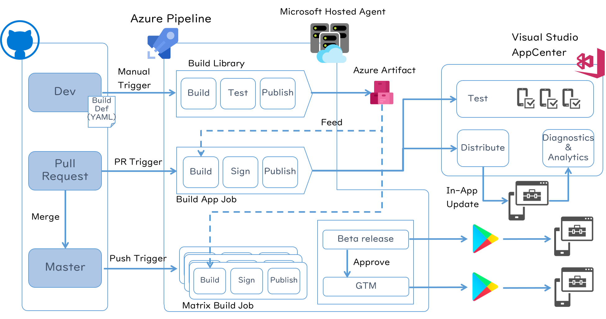
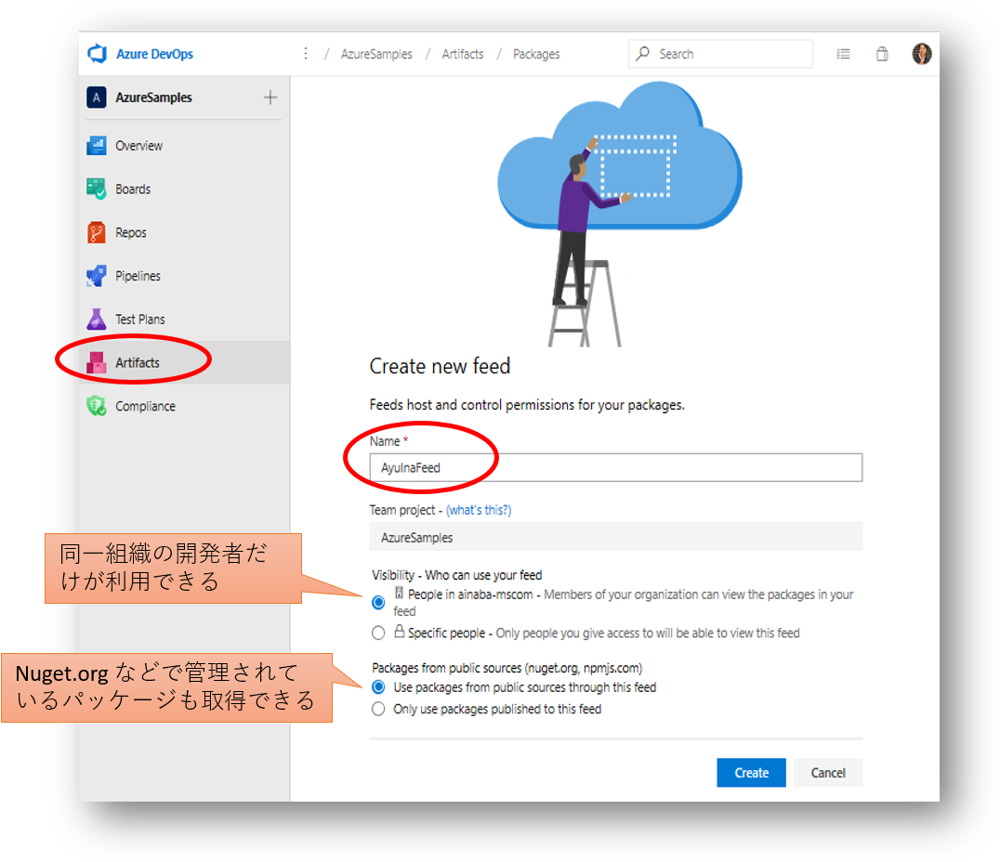
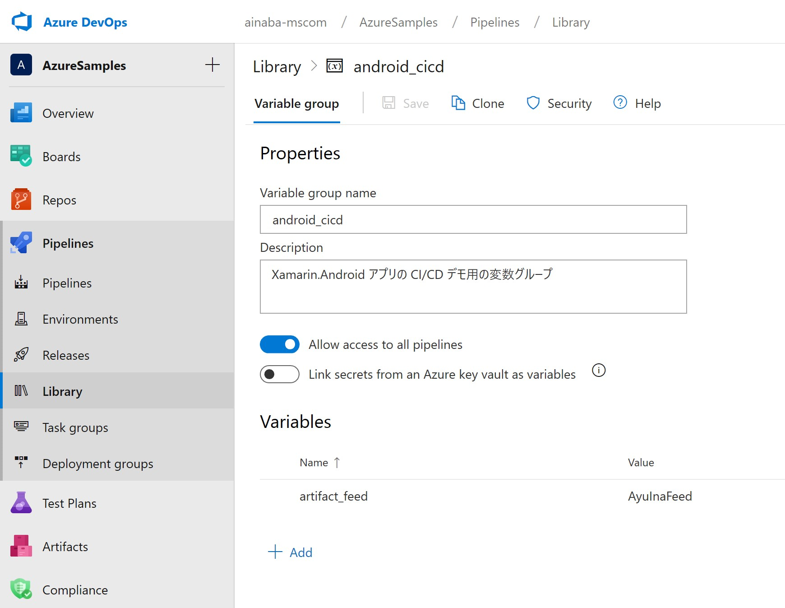

# Build Status

## azure-pipeline.yml

## azure-pipeline-multi.yml

# Introduction 

Github + Azure DevOps + Visual Studio AppCenter を使用した Android アプリの CI/CD デモ用のソースコードおよび手順書を管理しています。

# Getting Started

- [Demo1 : 手動トリガによるビルドと Azure Artifacts Feed への発行](./docs/demo1.md)
- [Demo2 : Pull Request トリガによるビルドと App Center への発行](./docs/demo2.md)
- [Demo3 : Push トリガによる並列ビルド](./docs/demo3.md)

## デモの実行に必要な環境

- GitHub アカウント
    - 本デモでは GitHub 上でソースコードおよび Pull Request を管理します
    - 本リポジトリからソースコードをフォークし自身で編集できるリポジトリが必要になります
    - [https://github.com](https://github.com)
- Azure DevOps アカウント
    - パイプライン処理およびパッケージ管理では Azure DevOps を使用します
    - [https://dev.azure.com](https://dev.azure.com)
- Visual Studio App Center アカウント
    - Xamarin Android を使用した CI/CD および自動テストを行うため、Visual Studio App Center の Distribute および Test 機能を利用します。
    - [https://appcenter.ms](https://appcenter.ms)

## 事前セットアップ

### [GitHub] リポジトリのフォーク

### [DevOps] プロジェクトの作成

### [DevOps] Artifact Feed の作成

このデモでは NuGet パッケージの管理サービスとして Azure Artifact を使用します。
同じプロジェクト内にフィードを作成しておいてください。

### [DevOps] Pipeline Variable Group の作成

各ビルド間で共有する値を格納する変数を設定します。
Pipeline メニューの Library から Variable Group を  `android_cicd`  という名前で作成します。
変数の名前はビルド定義の中から参照していますので下記の表とそろえる必要がありますが、
値はご自身の環境に合わせて設定してください。

| Name | Value | 用途 |
|:--|:--|:--|
| artifact_feed | AyuInaFeed | ビルド結果を NuGet パッケージとして共有するための Feed 名 |

### [App Center] Organization の作成

### [App Center] App の作成
