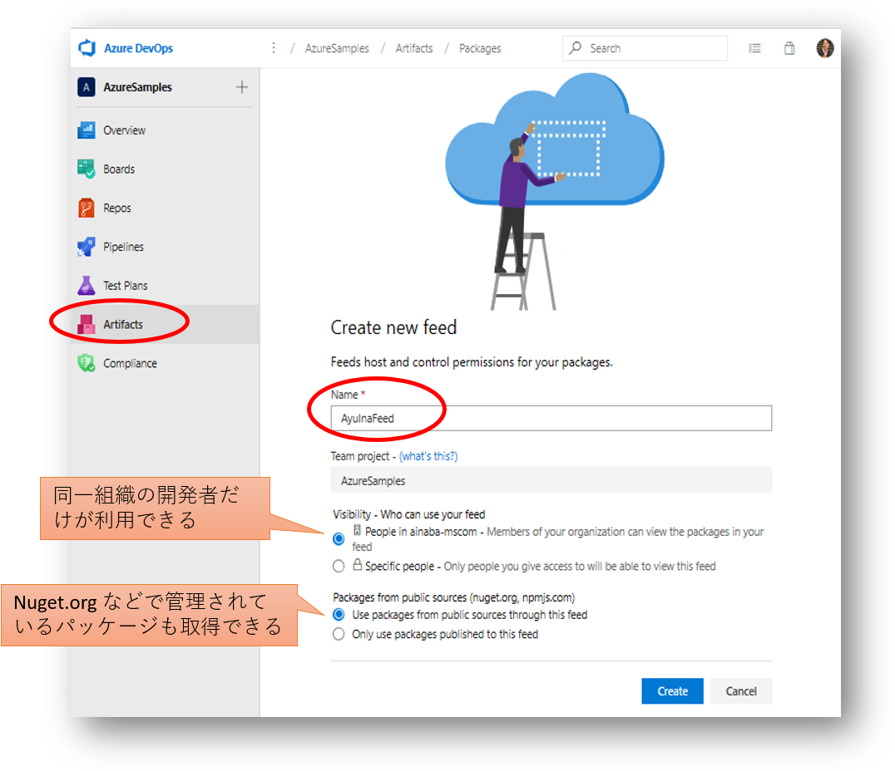
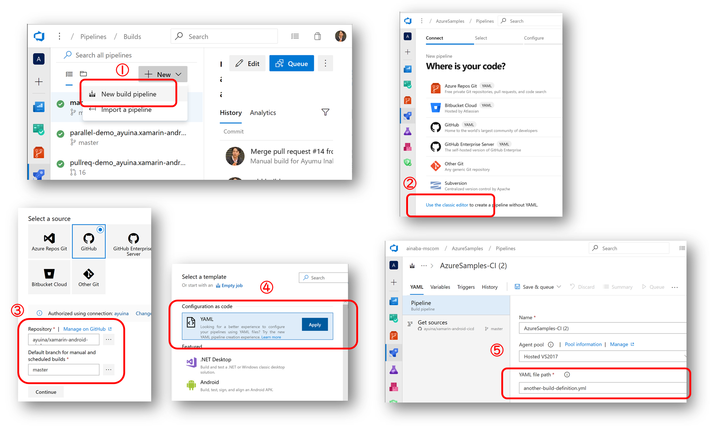

# Demo1 : 手動トリガによるビルドと Azure Artifacts Feed への発行

ここでは最もシンプルな手動トリガによるクラスライブラリのビルド、生成したライブラリのテスト、パッケージリポジトリへの発行を行います。
ビルドパイプラインの定義は [azure-pipelines-artifact.yml](../azure-pipelines-artifact.yml) に記載されています。

## 事前セットアップ

### Azure Artifact Feed の作成

このビルドでは最終的な出力結果を NuGet パッケージとして Azure Artifact に発行します。
同じプロジェクト内にフィードを作成しておいてください。

### 変数グループの作成

各ビルド間で共有する値を格納する変数を設定します。
Pipeline メニューの Library から Variable Group を  `android_cicd`  という名前で作成します。
変数の名前はビルド定義の中から参照していますので下記の表とそろえる必要がありますが、
値はご自身の環境に合わせて設定してください。

| Name | Value | 用途 |
|:--|:--|:--|
| artifact_feed | AyuInaFeed | ビルド結果を NuGet パッケージとして共有するための Feed 名 |

## ビルド定義の作成

Azure Pipeline にビルド定義を作成します。
パイプラインの定義が既定の名前 (`azure-pipelines.yml`) ではないので、ここではいったんクラシックエディタを使用して明示的に YAML ファイルを指定する手順としています。

1. ビルド定義を新規に作成する
1. ”クラシックエディタ” を使用する
1. GitHub のリポジトリとブランチを選択する
1. YAML ファイルを使用するテンプレートを選択する
1. ビルド定義 「`azure-pipelines-artifact.yml`」 を指定する

