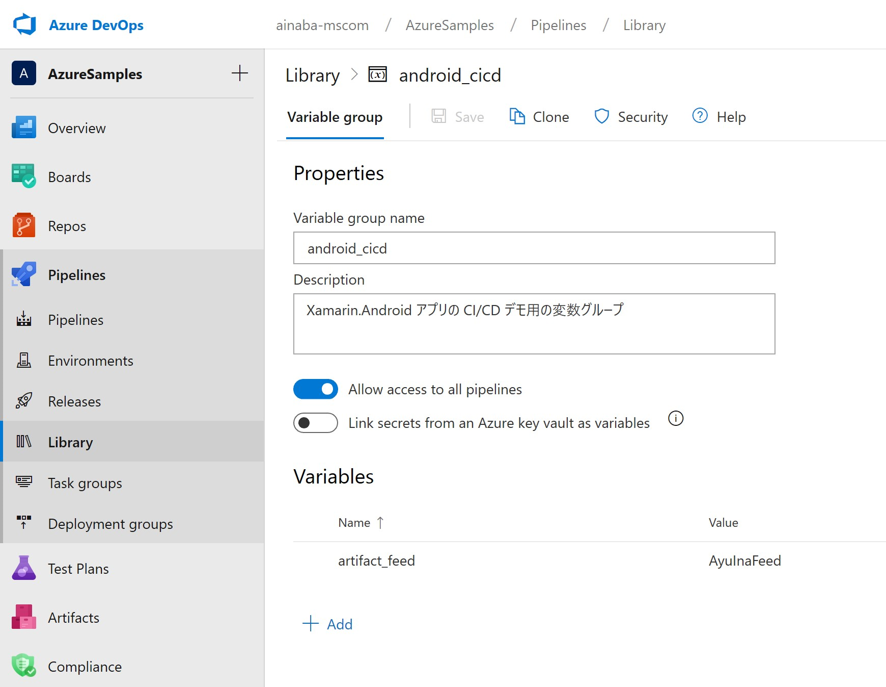
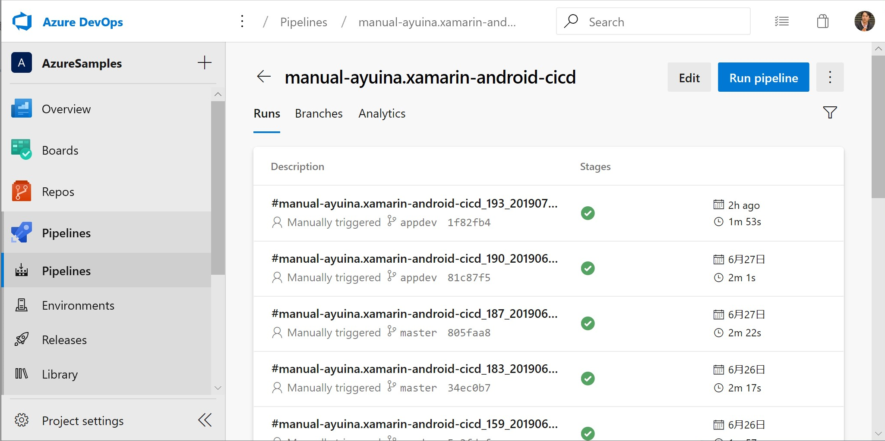
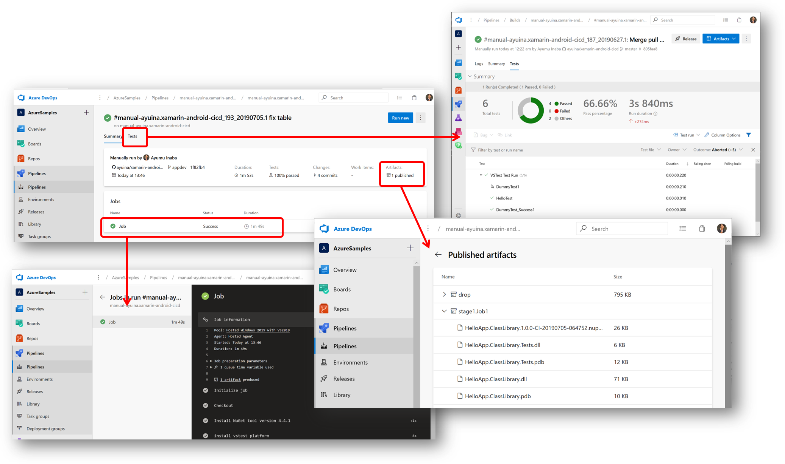

# Demo1 : 手動トリガによるビルドと Azure Artifacts Feed への発行

ここでは最もシンプルな手動トリガによるクラスライブラリのビルド、生成したライブラリのテスト、パッケージリポジトリへの発行を行うパイプラインを実行します。
パイプラインの定義は [azure-pipelines-artifact.yml](../azure-pipelines-artifact.yml) に記載されています。

## 事前セットアップ

### Azure Artifact Feed の作成

このビルドでは最終的な出力結果を NuGet パッケージとして Azure Artifact に発行します。
同じプロジェクト内にフィードを作成しておいてください。


### 変数グループの作成

各ビルド間で共有する値を格納する変数を設定します。
Pipeline メニューの Library から Variable Group を  `android_cicd`  という名前で作成します。
変数の名前はビルド定義の中から参照していますので下記の表とそろえる必要がありますが、
値はご自身の環境に合わせて設定してください。

| Name | Value | 用途 |
|:--|:--|:--|
| artifact_feed | AyuInaFeed | ビルド結果を NuGet パッケージとして共有するための Feed 名 |



## パイプライン定義の作成

Azure Pipeline に新しいパイプラインを作成します。
パイプラインの定義ファイルが既定の名前 (`azure-pipelines.yml`) ではないので、
ここではいったんクラシックエディタを使用して明示的に YAML ファイルを指定する手順としています。

1. パイプラインを新規に作成する
1. ”クラシックエディタ” を使用する
1. GitHub のリポジトリとブランチを選択する
1. YAML ファイルを使用するテンプレートを選択する
1. ビルド定義 「`azure-pipelines-artifact.yml`」 を指定する


## パイプライン実行

パイプラインの定義が出来上がったら `Run Pipeline` から実行してみましょう。



## 実行結果の確認

このパイプラインはシングルステージ、シングルジョブで定義されているので実行結果はシンプルです。



パイプライン定義で VSTest タスクを実行しているため、テストプロジェクトが実行され、
その結果が Test タブで表示されています。

```yaml
    - task: VSTest@2
      displayName: 'run unit test'
      inputs:
        testSelector: 'testAssemblies'
        testAssemblyVer2: '$(outputDirectory)/**/*.Tests.dll'

```

パイプライン定義で Nuget Push コマンドを実行しているため、
事前準備で用意したフィードに Nuget パッケージが発行されています。

```yaml
    - task: NuGetCommand@2
      displayName: 'NuGet push'
      inputs:
        command: push
        nuGetFeedType: 'internal'
        publishVstsFeed: $(artifact_feed)
        packagesToPush: '$(outputDirectory)/**/*.nupkg'
```

これは Azure Artifact 側でも確認できます。


またパイプライン定義で Publish Pipeline Artifact タスクによって成果物を発行しているので、
DLL や nupkg 等の成果物をダウンロードすることができるようになっています。

```yaml
    - task: PublishPipelineArtifact@1
      displayName: 'Publish Pipeline Artifact'
      inputs:
        targetPath: '$(outputDirectory)'
```
